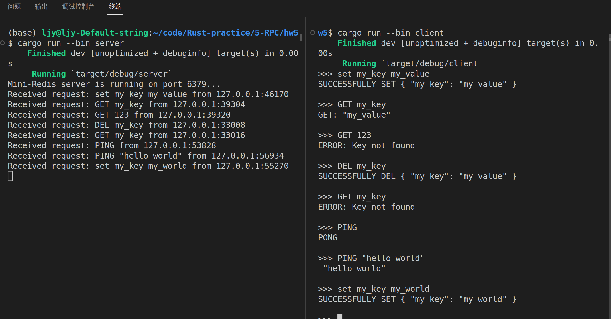

# HW5

作业5实现了一个基础版的mini-Redis，实现了 `get`，`set`，`del` 和 `ping` 四种操作，同时封装了一个client-cli进行请求。我并未成功实现中间filter，而是直接对非法请求返回 "ERROR" 信息。

在项目根目录下，运行server:

```bash
cargo run --bin server
```

运行client:

```bash
cargo run --bin client
```

实际运行效果如下：



client中对命令大小写不敏感，因为我在server中解析命令时统一转换为了大写。

PS：在练习中遇到很大一个bug是之前写了一句 

```rust
let request = String::from_utf8_lossy(&buffer).to_string();
```

 然后通过client传到server中的字符串后面一堆 '\0'，通过搜索发现这是因为这样直接将整个缓冲区的数据读了进去，最后通过设置只读取缓冲区有效数据解决了这个问题。

```rust
let bytes_read = stream.read(&mut buffer);
let request = String::from_utf8_lossy(&buffer[..bytes_read.unwrap()]).to_string();
```


