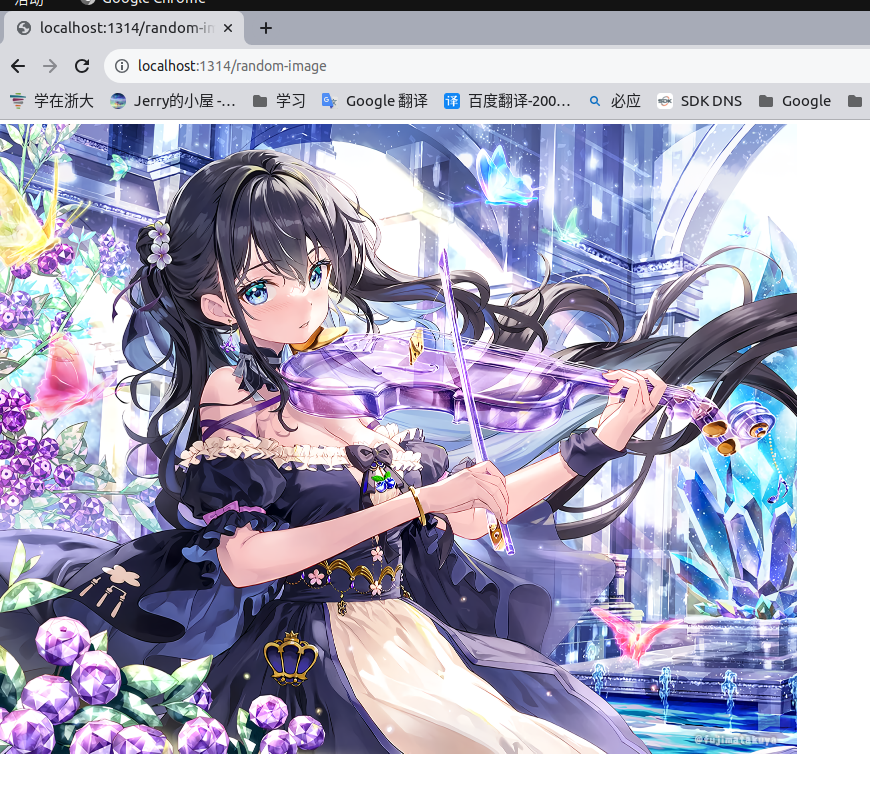

# HW6

因为上课时老师说主要是目的是自己使用axum探索http，不是非得去做mini-redis的http服务端，所以我编写了一个简陋的图床。效果为向服务端发送一次http请求，得到一张图片。

基本思路为得到请求后服务器随机返回一张图片的地址，再将图片所在地址的目录设置为静态资源。

**如何运行**

在项目的根目录下输入

```bash
cargo run
```

然后在浏览器中输入：

```
http://localhost:1314/random-image
```

就可以得到图片。

> 注：记得一定要在项目根目录下运行 `cargo run` 因为时间原因，并未来得及去设置服务端的根目录，所以访问图片的路径使用的是相对路径。

实际效果如下：


