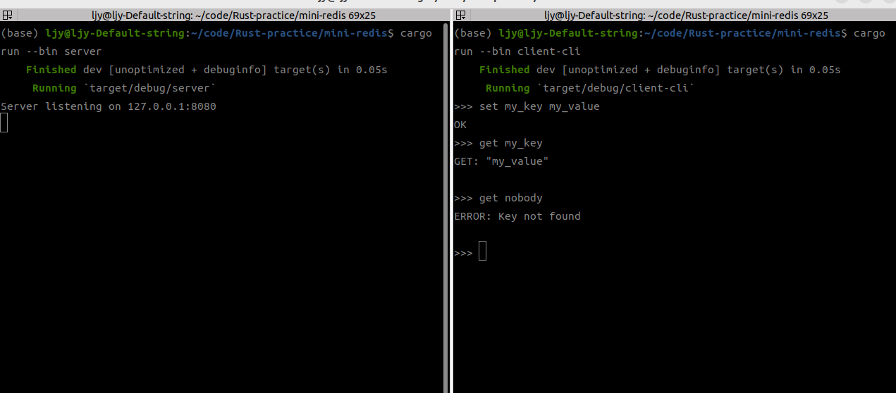
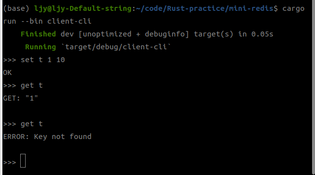
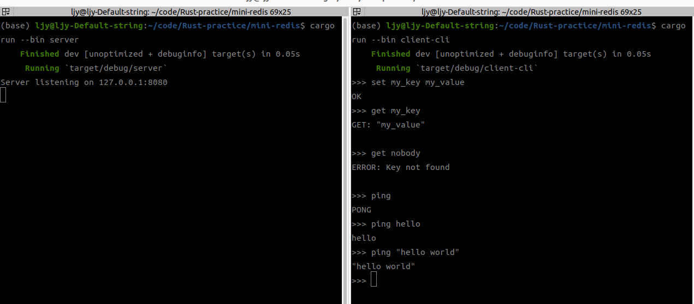
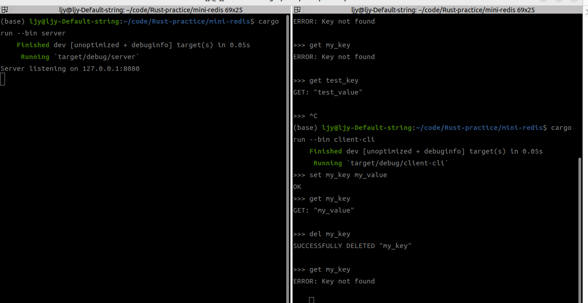
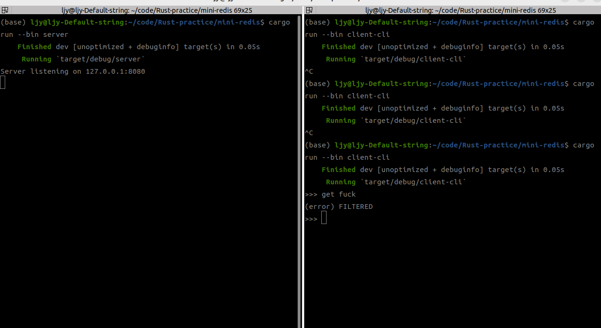
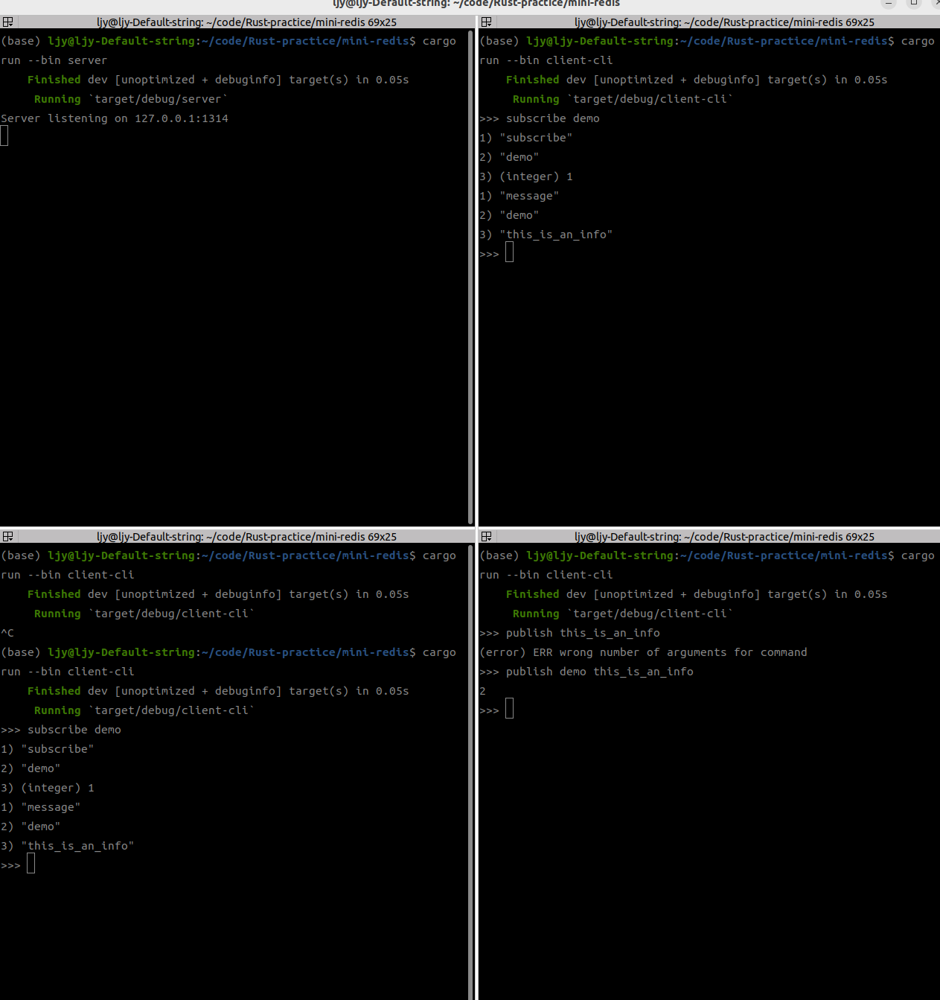

# HW5

本次作业要求实现一个mini-redis，实现了 get，set，ping，del 四个基础功能，同时封装了一个 client-cli 对 server 进行请求。并实现了一个中间层 "Filter" 针对 包含 "fuck" 字样的请求进行了阻止。在此基础上增添了简易的subscribe和publish功能。

**如何运行**

> 客户端连接不稳定，有时候运行客户端后如果没有出现 ">>> " 则需重新启动客户端

在项目根目录下，运行 server：

```bash
cargo run --bin server
```

在项目根目录下，运行 client-cli:

```bash
cargo run --bin client-cli
```

`set`, `get` 效果如下：



`set(expired)`: 10 s 后数据自动删除



`ping` 的效果如下：



`del` 效果如下：



"Filter"的效果如下：



`subscribe`, `publish` 效果如下：

`subscribe <channel>`, `publish <channel> <info>`, `subscribe` 输出订阅信息，`publish` 返回订阅者数目


